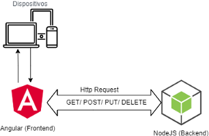
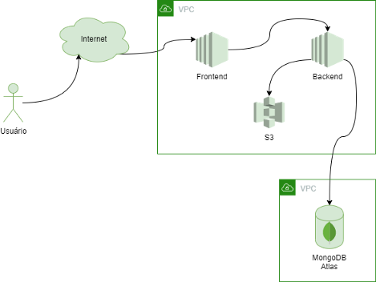

# Arquitetura

A aplicação usa o conceito de aplicação RESTful, “ Representational State Transfer, abreviado como REST, não é uma tecnologia, uma biblioteca, e nem tampouco uma arquitetura, mas sim um modelo a ser utilizado para se projetar arquiteturas de software distribuído, baseadas em comunicação via rede.” \(CAELUM, 2017\). Desta forma o sistema do Backend irá servir os dados para o Frontend através de URLs, onde este exibirá as informações para o usuário que irá realizar as interações que serão devolvidas ao Backend. A Imagem abaixo demonstra como funciona estas chamadas.

O Streaming do áudio será realizado com o NodeJs com uma biblioteca nativa do mesmo, e o Angular apenas entregará o áudio e controlará as ações do usuário. A árvore de escolhas da narrativa é definida pelo administrador que é responsável por fazer o upload dos áudios que são armazenados em um Bucket S3 da Amazon, “ O Amazon S3 é um serviço de armazenamento de objetos para internet altamente escalável, seguro e durável. Você pode utilizar o Amazon S3 para armazenar e recuperar qualquer quantidade de dados. Objetos armazenados no S3 podem ser acessados via HTTP/HTTPS.” \(IMASTERS, 2015\).

Tanto o Frontend quanto o Backend ficarão hospedados em máquinas EC2 isoladas para evitar qualquer conflito e facilitar as manutenções necessárias. O Backend irá conversar com o Amazon S3 que será responsável apenas por guardar os arquivos dos áudios para que o Backend possa fazer o streaming do mesmo, junto a isto o MongoDB Atlas fica dentro da própria estrutura da MongoDB e irá armazenar as informações dos usuários e dos áudios, guardando seu caminho no Amazon S3. A Imagem abaixo mostra como ficou esta arquitetura.

Próximo: [Canvas MVP](artefatos/canvas-mvp.md)

Voltar: [Documentação e Artefatos](./)

