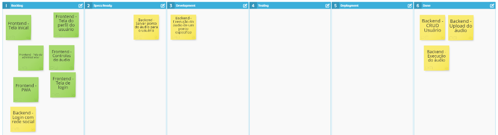

# Backlog

O Backlog foi criado com um Kanban dentro do Stormboard, na Imagem abaixo mostra os artefatos que fazem parte do Backlog e seus andamentos.

Próximo: [Perfil dos usuários](../validacao/perfil-dos-usuarios.md)

Voltar: [Documentação e Artefatos](https://github.com/bklass/darkcast-documentation)

