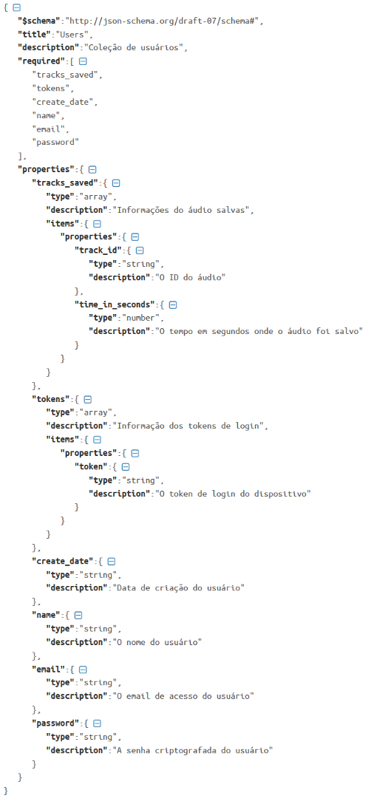
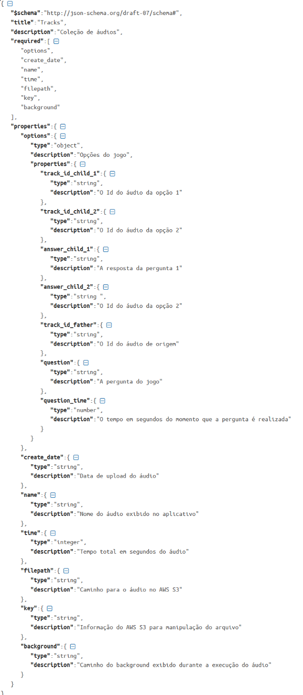

# Json Schema

Foi criado o JSON Schema das coleções que estão no MongoDB Atlas, sendo estas a coleção de “Users” e “Tracks” que ficam dentro da database “Darkcast”.

Na Imagem abaixo temos a coleção de “Users” que consiste nas informações do usuário para termos o Login e Salvar o progresso dos áudio, posteriormente poderá conter informações sobre as mídias sociais para realizar o compartilhamento sobre a sua experiência na narrativa.

Na Imagem abaixo temos a coleção de “Tracks” que consiste nas informações do áudio, onde temos o seu caminho até o Amazon S3, tempo total de áudio, quais outros áudios estão envolvidos com a narrativa e com a tomada de decisão do usuário e a informação chave para o Streaming \(subpastas e o nome do arquivo físico\).

