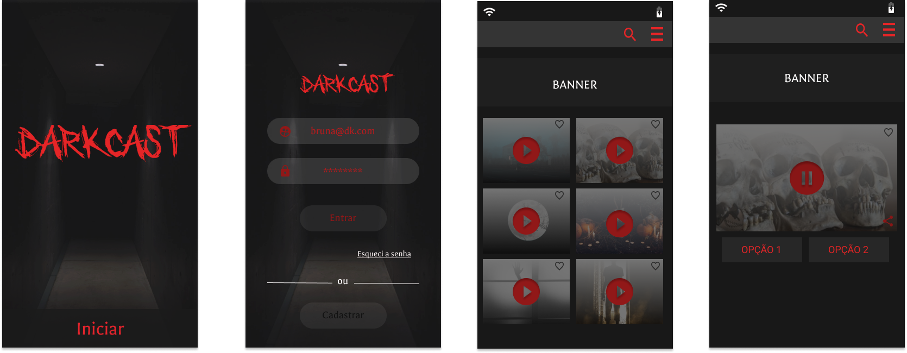

# Wireframe de Alta Fidelidade

Com base no Crazy 8 foi utilizado o Figma para criar os wireframes de alta fidelidade, na imagem abaixo é possível ver este artefato que consiste da entrada do usuário no Darkcast até as escolhas do áudio.

O fluxo pensado incialmente era este porém devido a experiência do usuário foi resolvido mudar a tela de "Iniciar" para a segunda posição para dar a sensação de inicio do jogo ao invés de uma tela de cadastro.

Próximo: [Backlog](backlog.md)

Voltar: [Documentação e Artefatos](../)

