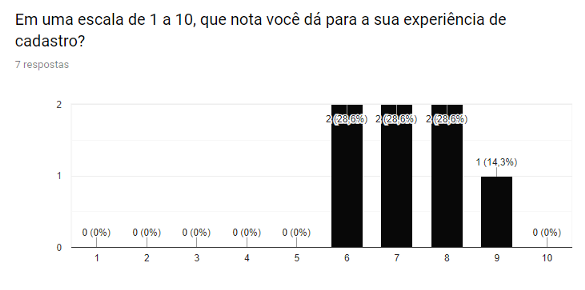
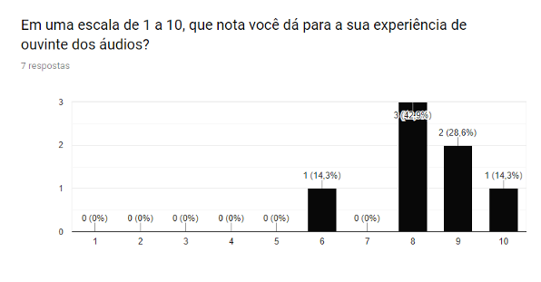
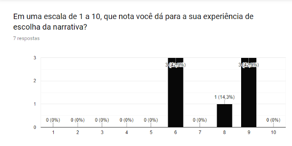
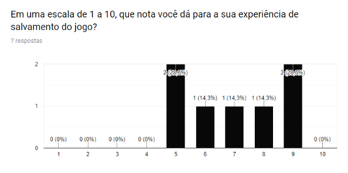
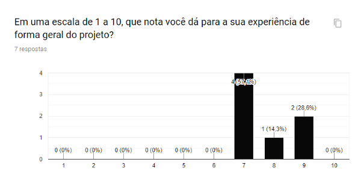

# Experiência do usuário

Nesta sessão foi avaliado em uma escala de 1 a 10 como foi a experiência do usuário em determinadas ações onde a nossa meta era atingir a nota 7 ou maior.

Na Imagem abaixo temos a experiência de cadastro onde tivemos uma média de 7,2, acima da meta desejada.

Na Imagem abaixo tivemos a avaliação do streaming do áudio e da experiência de ouvir o mesmo, ao qual foi obtido uma média de 8,2.

A próxima pergunta era referente a opção da escolha do jogo e a média obtida foi de 7,5 como pode ser visto na Imagem abaixo.

Na pergunta exibida na Imagem abaixo foi avaliado a experiência de salvar o progresso do jogo para retornar do mesmo ponto anterior, a média das notas foi de 7.

Por fim foi realizada a pergunta da experiência de forma geral do uso do sistema, ao qual a média foi de 7,7 conforme visto na Imagem abaixo.

De acordo com as médias das notas recebidas e a nota meta estabelecida podemos ver que o sistema teve uma boa aceitação do público.

[Considerações gerais do sistema](consideracoes-gerais-do-sistema.md)

[Documentação e Artefatos](../)

