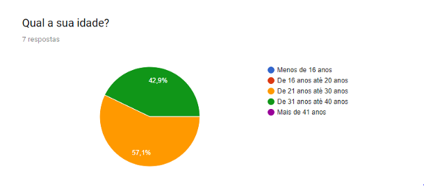
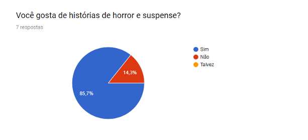
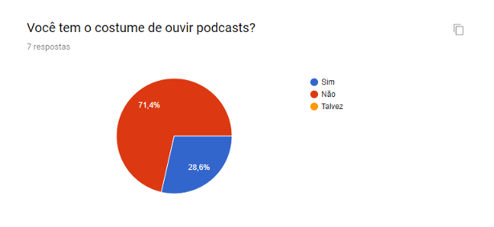
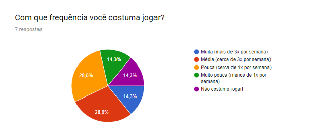

# Perfil dos usuários

A faixa etária ficou levemente divida entre jovens adultos \(de 21 anos até 30 anos\) e adultos \(31 anos até 40 anos\) conforme na Imagem abaixo.

Sobre o interesse em histórias e terror e suspense que são o foco do Darkcast, tivemos uma margem bastante positiva, com 87,7% dos usuários interessados nos estilos, conforme pode ser visto na Imagem abaixo.

Nas Imagens abaixo temos as respostas sobre hábitos, onde foi questionado se os usuários costumam ouvir podcasts se costumam jogar jogos e com que frequência.

Os resultados mostram que 71,4% dos usuários já costumam ouvir podcasts e que mais de 85% dos usuários costumam jogar.

Próximo: [Experiência do usuário](experiencia-do-usuario.md)

Voltar: [Documentação e Artefatos](https://github.com/bklass/darkcast-documentation)

